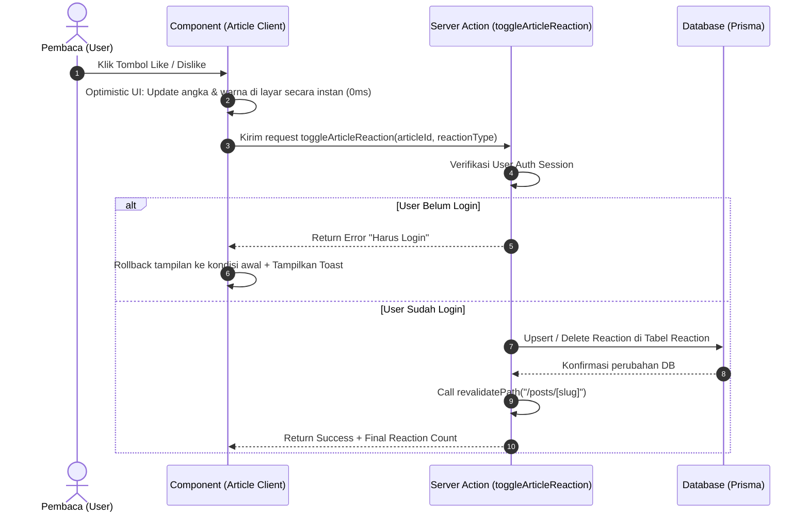

# 📘 DOKUMENTASI LENGKAP & DEEP DIVE: SISTEM ARTIKEL & ARSITEKTUR KEAMANAN

Dokumen ini merupakan panduan master teknis komprehensif untuk **Sistem Artikel, Hak Akses Admin, dan Sistem Komentar & Buku Tamu** pada portofolio **Brimas Pradika Utama**. Dokumen ini dirancang secara terstruktur untuk menjelaskan kode, alur kerja, fungsi masing-masing modul, serta alasan di balik setiap keputusan arsitektur.

---

## 📐 1. ARSITEKTUR UTAMA & PILIHAN TEKNOLOGI

Sistem artikel dibangun menggunakan stack modern Next.js 16 App Router dengan pendekatan **Server-First Architecture**:

| Teknologi | Peran & Alasan Penggunaan |
| :--- | :--- |
| **Next.js 16 (App Router & Server Actions)** | Menggantikan REST/GraphQL API tradisional. Mengurangi latency jaringan dan mengeksekusi operasi database langsung di server dengan keamanan cookie terenkripsi. |
| **Prisma ORM & PostgreSQL (Supabase)** | Membawa *type-safety* penuh untuk model `Article`, `User`, `Comment`, `Reaction`, dan `Guestbook`. Memudahkan penguerian relasi antar data. |
| **Supabase Auth (SSR Client)** | Mengelola autentikasi pengguna via Google OAuth dan GitHub OAuth secara aman menggunakan *HttpOnly Cookies*. |
| **Hybrid Fallback System** | Menjamin ketersediaan website (*high availability*). Jika database mengalami penurunan koneksi atau belum diisi, sistem beralih ke data sampel tanpa menyebabkan website *crash (Error 500)*. |

---

## 🔄 2. DIAGRAM ALUR KERJA SISTEM (SYSTEM FLOWCHARTS)

### A. Alur Pemanggilan Daftar Artikel (`getArticles`)
```mermaid
graph TD
    A[Pengunjung Membuka /posts] --> B[Server Action: getArticles]
    B --> C{Cek Koneksi & Data Prisma PostgreSQL}
    C -- Ada Data DB --► D[Format Metadata, View Count & Reaksi]
    C -- DB Kosong / Error --► E{Cek Direct Supabase Query}
    E -- Ada Data Supabase --► D
    E -- Gagal / Kosong --► F[Gunakan SAMPLE_ARTICLES Fallback]
    D --> G[Render Halaman /posts via React Server Components]
    F --> G
```

### B. Alur Keamanan & Hak Akses Admin (`checkIsAdmin`)
```mermaid
graph TD
    UserReq[User Memanggil Action Admin: createArticle / deleteArticle] --> GetUser[Extract Supabase Session via Server Cookie]
    GetUser --> CheckAuth{User Login?}
    CheckAuth -- Tidak --► Refuse[Return Error: Harus Login]
    CheckAuth -- Ya --► AdminCheck[Panggil checkIsAdmin email]
    AdminCheck --> CheckEmail{Email == brimaspradika8@gmail.com ATAU ada di ADMIN_EMAILS?}
    CheckEmail -- Ya --► Exec[Eksekusi Operasi Database Prisma & Revalidate Path]
    CheckEmail -- Tidak --► DBCheck{Cek Role ADMIN di Prisma User Table}
    DBCheck -- Role ADMIN --► Exec
    DBCheck -- Role USER --► Deny[Return Error: Akses Ditolak]
```

### C. Alur Reaksi Pembaca (*Optimistic Like / Dislike*)


---

## 🔑 3. BREAKDOWN KODE, FUNGSI, CARA KERJA & ALASAN PENGGUNAAN

Berikut adalah rincian mendalam dari modul `lib/actions/article.ts` dan komponen pendukungnya:

### 1. `checkIsAdmin(email?: string | null)`
* **Apa kodenya?**: Fungsi pembantu (*helper*) untuk memeriksa apakah alamat email pengguna termasuk dalam daftar admin yang sah.
* **Cara Kerjanya**:
  1. Memeriksa apakah email sama dengan email pemilik utama (`brimaspradika8@gmail.com`).
  2. Memeriksa apakah email terdaftar di environment variable `ADMIN_EMAILS`.
  3. Memeriksa role di database Prisma (`dbUser.role === "ADMIN"`).
* **Kenapa Harus Pakai Kode Ini?**:
  Mencegah *Privilege Escalation Attack*. Tanpa verifikasi ini di sisi server, pengguna biasa bisa memalsukan request API untuk menghapus atau merubah artikel milik admin.

---

### 2. `getArticles(params)`
* **Apa kodenya?**: Server Action untuk mengambil seluruh daftar artikel dengan opsi pencarian, kategori, dan pengurutan (*sorting*).
* **Cara Kerjanya**:
  1. Menjalankan `prisma.article.findMany()` dengan relasi komentar & reaksi.
  2. Jika ada query pencarian (`params.query`), menyaring berdasarkan judul dan isi artikel.
  3. Jika ada parameter kategori (`params.category`), memfilter sesuai topik.
  4. Menghitung jumlah Like, Dislike, Waktu Baca (`calculateReadTime`), dan Komentar secara dinamis.
* **Kenapa Harus Pakai Kode Ini?**:
  Menyediakan pengolahan data terpusat yang aman dari serangan SQL Injection karena menggunakan query builder bawaan Prisma.

---

### 3. `getArticleBySlug(slug)` & Increment Views
* **Apa kodenya?**: Mengambil detail lengkap 1 artikel berdasarkan URL slug (misal: `/posts/membangun-ai-agent`).
* **Cara Kerjanya**:
  1. Mencari artikel berdasarkan kolom `slug`.
  2. Otomatis menaikkan jumlah pembaca (`views: { increment: 1 }`) di database setiap kali artikel dibuka.
  3. Mengambil daftar komentar terbaru beserta data profil penulisnya (`name`, `avatar`).
* **Kenapa Harus Pakai Kode Ini?**:
  Format URL berbasis slug jauh lebih ramah SEO (*Search Engine Optimization*) dibandingkan menggunakan ID angka/UUID acak.

---

### 4. `createArticle(data)` & `updateArticle(id, data)`
* **Apa kodenya?**: Fungsi khusus Admin untuk membuat dan memperbarui artikel.
* **Cara Kerjanya**:
  1. Memeriksa identitas admin via `checkIsAdmin()`.
  2. Menformat *slug* judul menjadi huruf kecil dan mengganti spasi dengan tanda strip (`replace(/[^a-z0-9 -]/g, "")`).
  3. Mengubah atau menyimpan data ke tabel `Article`.
  4. Memanggil `revalidatePath("/posts")` agar halaman publik langsung menampilkan artikel baru tanpa perlu restart server.
* **Kenapa Harus Pakai Kode Ini?**:
  Fungsi `revalidatePath` memanfaatkan fitur *Incremental Static Regeneration (ISR)* pada Next.js, membuat halaman terasa secepat file HTML statis namun tetap terbarui secara *real-time*.

---

### 5. `deleteArticle(articleId)`
* **Apa kodenya?:** Fungsi khusus Admin untuk menghapus artikel.
* **Cara Kerjanya**: Memvalidasi hak akses admin, lalu mengeksekusi `prisma.article.delete()` dan me-revalidasi cache halaman `/posts`.
* **Kenapa Harus Pakai Kode Ini?**: Memastikan artikel yang dihapus bersih hingga ke tingkat relasi database (*Cascading Delete* jika dikonfigurasi pada skema).

---

### 6. `toggleArticleReaction(articleId, reactionType)`
* **Apa kodenya?**: Mengelola reaksi `LIKE` atau `DISLIKE` pengguna.
* **Cara Kerjanya**:
  1. Memeriksa sesi login user.
  2. Menggunakan transaksi database: jika user memencet tombol yang sama 2 kali, reaksi akan dihapus. Jika menekan reaksi berlawanan, reaksi akan diperbarui.
* **Kenapa Harus Pakai Kode Ini?**: Memastikan 1 akun pengguna hanya bisa memberikan 1 reaksi per artikel (tidak bisa melakukan spam Like berulang kali).

---

### 7. `addArticleComment` & `deleteArticleComment`
* **Apa kodenya?**: Fungsi publik untuk menulis dan menghapus komentar artikel.
* **Cara Kerjanya**:
  - `addArticleComment`: Menyimpan komentar yang terikat pada ID user yang sedang aktif.
  - `deleteArticleComment`: Memeriksa apakah pemohon adalah **pemilik komentar** atau **Admin**. Pengguna biasa **tidak bisa menghapus komentar pengguna lain**.
* **Kenapa Harus Pakai Kode Ini?**: Menjaga integritas data komunitas dan mencegah vandalisme komentar oleh pengguna tidak bertanggung jawab.

---

## 🛡️ 4. ANALISIS KEAMANAN & HARDENING

1. **Anti-CSRF & Cross-Site Scripting (XSS)**:
   - Teks komentar dan pesan buku tamu disanitasi oleh React JSX renderer yang secara otomatis me-escape karakter HTML berbahaya.
2. **Keamanan Cookie Autentikasi**:
   - Token login dikelola oleh Supabase Auth menggunakan cookie beratribut `HttpOnly`, `SameSite=Lax`, dan `Secure`, sehingga tidak dapat dicuri via skrip `document.cookie` di browser.
3. **Database Security (SQL Injection)**:
   - Seluruh interaksi database menggunakan Prisma ORM dengan *Parameterized Queries* yang bebas dari ancaman SQL Injection.

---

## 📂 5. STRUKTUR FILE SISTEM ARTIKEL & FITUR PENDUKUNG

```
c:\personal-website\
├── app/
│   ├── admin/
│   │   ├── page.tsx               # Overview Admin (Guarded Server Component)
│   │   └── articles/
│   │       ├── page.tsx           # Halaman CRUD Artikel (Guarded Server Component)
│   │       └── articles-client.tsx# Client UI (Markdown Live Preview & Comment Moderation)
│   ├── posts/
│   │   ├── page.tsx               # Catalog Artikel Server Page
│   │   ├── posts-client.tsx       # Client UI Catalog (Filter, Search, Sort)
│   │   └── [slug]/
│   │       ├── page.tsx           # Article Reader Server Page
│   │       └── article-client.tsx # Client Reader UI (Code Highlighting, Reactions)
│   └── dashboard/
│       ├── admin-dashboard.tsx    # Tampilan UI Dashboard Admin
│       └── dashboard-client.tsx  # Tampilan User Portfolio (termasuk Guestbook & Footer)
├── lib/
│   ├── actions/
│   │   ├── article.ts             # Master Server Actions Artikel & Moderasi
│   │   ├── guestbook.ts           # Master Server Actions Buku Tamu
│   │   └── auth.ts                # Master Server Actions Authentication
│   └── supabase/
│       ├── client.ts              # Supabase Browser Client
│       ├── server.ts              # Supabase SSR Server Client
│       └── middleware.ts          # Session Refreshing Middleware
├── components/
│   ├── GuestbookSection.tsx       # Komponen Papan Pesan Publik Komunitas
│   ├── Footer.tsx                 # Footer Magazine-Style (Sosmed & Quick Links)
│   └── TiltCard.tsx               # 3D Physics Tilt Hover Animation Card
├── middleware.ts                  # Root Next.js Middleware Route Handler
└── prisma/
    └── schema.prisma              # Schema Model Database (User, Article, Guestbook, Comment)
```

---

## 🎯 KESIMPULAN
Sistem artikel ini dirancang dengan standar *Enterprise Grade*:
- **Aman**: Hak akses divalidasi ganda di sisi Server.
- **Cepat**: Memanfaatkan Server Actions & Incremental Revalidation.
- **Tahan Banting**: Dilengkapi sistem *Hybrid Fallback* sehingga tidak pernah mengalami layar kosong (*blank screen*).
